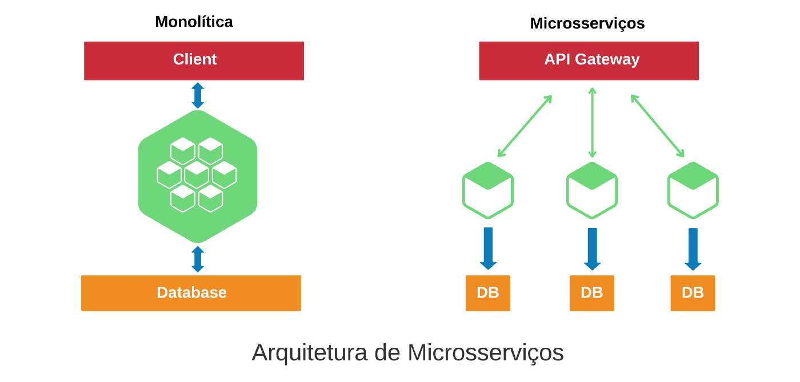

<div align="center" id="top"> 
  

&#xa0;

</div>

<h1 align="center">Conceitos básicos da construção de microsserviços com Node.js</h1>

<p align="center">
  


</p>

<p align="center">
  <a href="#dart-about">About</a> &#xa0; | &#xa0; 
  <a href="#sparkles-features">Features</a> &#xa0; | &#xa0;
  <a href="#rocket-technologies">Technologies</a> &#xa0; | &#xa0;
  <a href="#white_check_mark-requirements">Requirements</a> &#xa0; | &#xa0;
  <a href="#checkered_flag-starting">Starting</a> &#xa0; | &#xa0;
  <a href="#memo-license">License</a> &#xa0; | &#xa0;
  <a href="https://github.com/wsasouza" target="_blank">Author</a>
</p>

<br>

## :dart: About

Describe your project

## Princípios de microsserviços

- Única responsabilidade dentro do domínio
  - O que é domínio (DDD)?
- Autonomia (sem dependências entre serviços)

### Ganhos

- Independência
  - Times
  - Github
  - CI/CD
- Fácil manutenção
  - Menos código
  - Menos responsabilidades
  - Menos testes
  - Ambiente de dev mais enxuto
- Escalonamento independente

### Desafios

- Observabilidade
- Comunicação
- Resiliência a falhas

### Conceitos importantes

- Isolar por domínios
  - A mesma entidade pode ser representada de formas diferentes em cada domínio
- Banco de dados isolados
- Comunicação assíncrona

## Hands-on

### App

Uma aplicação que simula o recebimento de uma compra e envia os dados do produto comprado para outra plataforma “liberar o acesso” do usuário ao produto.

### Ferramentas

- Kafka
- Node.js
- TypeScript
- PostgreSQL

### Deploy

- Upstash Kafka
- Railway Node.js

## :rocket: Technologies

The following tools were used in this project:

- [Kafka](https://kafka.apache.org/)
- [Node.js](https://nodejs.org/en/)
- [Docker-Compose](https://docs.docker.com/compose/)
- [PostgreSQL](https://www.postgresql.org/)
- [TypeScript](https://www.typescriptlang.org/)

## :white_check_mark: Requirements

Before starting :checkered_flag:, you need to have [Git](https://git-scm.com) and [Node](https://nodejs.org/en/) installed.

## :checkered_flag: Starting

```bash
# Clone this project
$ git clone https://github.com/wsasouza/basics-microservices-node.js.git

# Access
$ cd microservices-base-decode

# Run Docker Compose
$ docker-compose up -d

# Configure Environment Variables
$ cd apps/classroom/.env.example
$ cd apps/purchases/.env.example

# Install dependencies
$ cd apps/classroom
$ npm install

$ cd ../purchases
$ npm install

# Run the project
$ cd apps/classroom
$ npm run start:dev

$ cd ../purchases
$ npm run start:dev

# The server will initialize in the <http://localhost:3333>
```

## :memo: License

This project is under license from MIT. For more details, see the [LICENSE](LICENSE.md) file.

Made with :heart: by <a href="https://github.com/wsasouza" target="_blank">Walter Santos de Andrade Souza</a>

&#xa0;

<a href="#top">Back to top</a>
